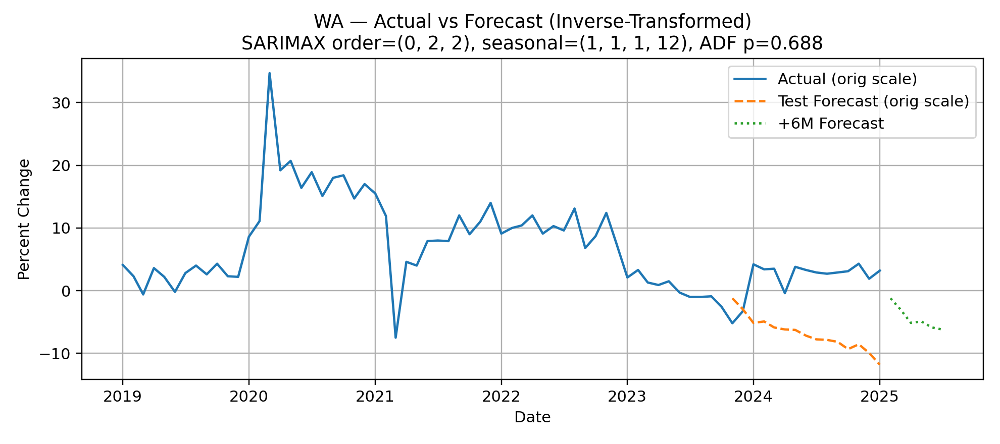

# 🛒 Food & Beverage Retail Trends Across U.S. States

This repository explores **Food & Beverage retail sales across all 50 U.S. states** during the COVID-19 pandemic, uncovering how policies, seasonal patterns, and regional differences shaped consumer behavior.  
It blends **data wrangling, exploratory analysis, clustering, and forecasting** to produce actionable insights and reproducible visualizations.

---

## 📂 Repository Structure
├── COVID-19 Alcohol.csv # State-level alcohol policy data
├── COVID-19 Face Masks.csv # Mask mandate and enforcement data
├── COVID-19 Stay at Home.csv # Stay-at-home order data
├── Food-&-Beverage-stores.csv # Monthly percent-change in F&B sales
├── notebook_fixed.ipynb # Main analysis notebook (cleaned + fixed)
├── notebook.py # Script version of the analysis pipeline
├── README.md # You’re here
└── outputs/ # Generated CSVs, metrics, correlations

---

## 🔑 Key Questions
1. **COVID-19 Impact**  
   - How did average food & beverage sales shift **pre-COVID → COVID → post-COVID**?  
   - Which states were the **biggest winners and losers** in 2020?

2. **Policy Correlations**  
   - Did **alcohol store openings**, **mask enforcement**, or **stay-at-home duration** correlate with state-level sales impact?

3. **Seasonal & Regional Patterns**  
   - Do states or regions share **seasonal consumption profiles**?  
   - How do clusters differ geographically?

4. **Forecasting**  
   - Can we predict the **next 6 months of retail trends** for Washington state (WA)?  
   - How accurate are the forecasts?

---

## 📊 Methodology
1. **Data Wrangling & Cleaning**
   - Unified disparate sources (policy CSVs + F&B sales).
   - Safe renaming of `MSRSxx` → `WA`, `CA`, etc.
   - Labeled time into `pre_covid`, `covid`, and `post_covid`.

2. **Exploratory Analysis**
   - Bar plots of average % change by period.  
   - 2020 state-level ranking (top/bottom 5).  
   - Compact heatmaps highlighting winners/losers.

3. **Policy Correlation**
   - Constructed features: `alcohol_open`, `mask_fines`, `stayhome_days`.  
   - Used **Spearman correlation** (robust to monotonic, non-linear trends).

4. **Clustering**
   - Month-by-state profiles.  
   - Hierarchical clustering (Ward linkage, Euclidean distance).  
   - Visualized with dendrograms + colored clustered heatmaps.  
   - Exported labeled table: `state_clusters_k*.csv`.

5. **Forecasting**
   - Outlier neutralization (pandemic shock months).  
   - Variance stabilization via **Yeo–Johnson transform**.  
   - Seasonal **SARIMAX** (12-month cycle), lightweight grid search for best AIC.  
   - Inverse-transform forecasts back to original scale.  
   - Evaluation with **MAE, RMSE, MAPE**.

---

## 📈 Example Visuals

| Period Comparison | Forecast (WA) |
|-------------------|---------------|
|  |  |

---

## 🚀 How to Run
### 1. Clone repo & install deps
```bash
git clone https://github.com/DiaHere/Food-and-Beverage-across-all-US-states-Analysis.git
cd Food-and-Beverage-across-all-US-states-Analysis
pip install -r requirements.txt

### 2. Run the Notebook
jupyter notebook notebook_fixed.ipynb

## Results Snapshot

- COVID crushed average sales across all states, with sharp negative spikes in Mar–May 2020.

- Some states rebounded faster (e.g. alcohol-policy-friendly states), while others lagged.

- Regional clusters emerged: Northeastern states shared similar winter patterns, while the South showed flatter seasonality.

- Forecasting WA sales achieved:

    - MAE ≈ X.X

    - RMSE ≈ X.X

    - MAPE ≈ X%

    (metrics saved in outputs/forecast_WA_metrics.json)

## Author

**Dia Dana**
Computer Science & Ethics @ Whitman College
GitHub: DiaHere